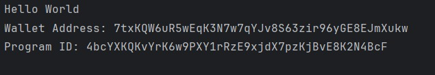

# Solana Hello World Program

This repository contains the source code for a simple "Hello World" program deployed on the Solana blockchain. This project was created as part of an assignment for the Blockchain Technologies 2 course.

## Table of Contents

-   [Usage](#usage)
-   [Demo Screenshots](#demo-screenshots)
-   [Examples](#examples)
-   [License](#license)

## Usage

1.  **Install Solana CLI:**

    * Follow the official guide to install the Solana Command Line Interface (CLI): [https://solana.com/docs/intro/installation](https://solana.com/docs/intro/installation) [cite: 1]
    * This step is crucial for interacting with the Solana blockchain, building, and deploying programs.

2.  **Build the program:**

    * Navigate to the program's directory in your terminal.
    * Use the `cargo build-bpf` command to build the Rust smart contract. This command compiles the Rust code into a BPF (Berkeley Packet Filter) bytecode, which is the format Solana programs use. [cite: 1]

3.  **Deploy the program:**

    * Use the Solana CLI to deploy the built program to the devnet.
    * You'll need to have some SOL (Solana's native token) in your wallet to pay for the deployment transaction.
    * The command will involve specifying the program's .so file and potentially updating the program if it already exists.
    * Note down the Program ID after successful deployment. This ID is used to interact with your deployed program. [cite: 1]

4.  **Interact with the program:**

    * Use the Solana CLI to call the program and verify the output.
    * This usually involves using the `solana program call` command, specifying the Program ID, and passing any necessary data.

## Demo Screenshots

Output:


*Output*

## Examples

### Building the Program

```bash
cargo build-bpf
```

### Deploying the Program

```bash
solana program deploy <path_to_program.so>
```

## License

This project is licensed under the MIT License - see the [LICENSE](LICENSE) file for details.
